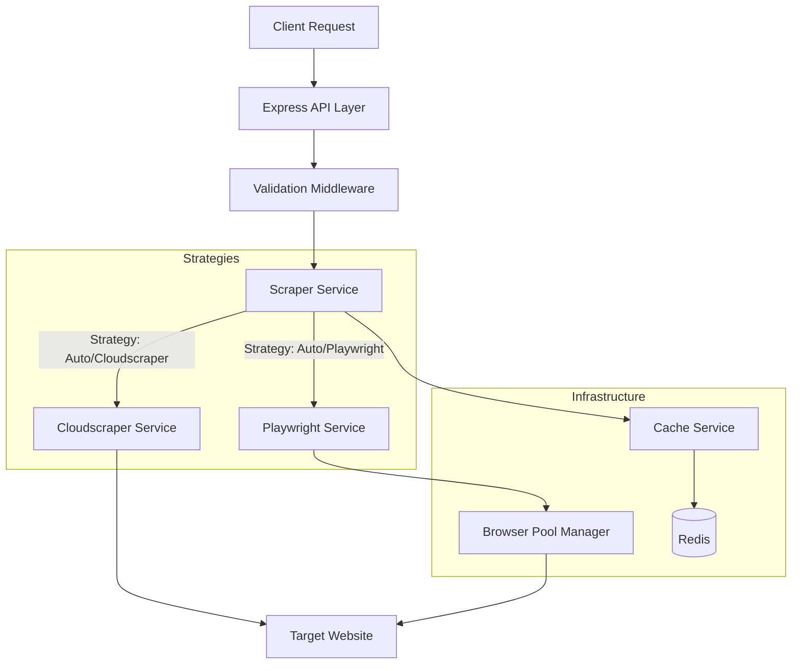

<div align="center">


<p>
  <a href="LICENSE">
    
  </a>
  <a href="https://www.typescriptlang.org/">
    
  </a>
  <a href="https://nodejs.org/">
    
  </a>
  <a href="https://www.docker.com/">
    
  </a>
</p>

<p>
  <a href="http://localhost:3001/api-docs">
    
  </a>
  <a href="https://github.com/ilhmlnaa/crawlix/issues">
    
  </a>
  <a href="https://github.com/ilhmlnaa/crawlix/issues">
    
  </a>
</p>

</div>

<hr />

# 🕷️ Crawlix

> **A web scraping API service built with Node.js, Express, and TypeScript.**

This service is the scraping engine powering the [Zenime.online](https://zenime.online) personal project. It provides a unified API to fetch content from the web using multiple strategies, handling dynamic content, rate limiting, proxies, and caching to ensure reliability.

---

## 📑 Table of Contents

- [Features](#-features)
- [Architecture](#-architecture)
- [Tech Stack](#-tech-stack)
- [Prerequisites](#-prerequisites)
- [Installation](#-installation)
- [Configuration](#-configuration)
- [Running the Service](#-running-the-service)
- [Docker Support](#-docker-support)
- [API Documentation](#-api-documentation)
- [Performance Optimization](#-performance-optimization)
- [License](#-license)

---

## ✨ Features

- **Strategy Selection**:
  - `auto`: Tries Cloudscraper first, falls back to Playwright if needed.
  - `cloudscraper`: For static pages (bypasses some protections).
  - `playwright`: Browser automation for dynamic JS sites.
- **Reliability**:
  - **Auto-Retry**: Exponential backoff for failed requests.
  - **Rate Limiting**: Built-in protection against abuse.
  - **Proxy Support**: Integration with proxy servers.

- **Performance**:
  - **Browser Pooling**: Management of Playwright instances.
  - **Redis Caching**: Configurable caching to reduce load.
  - **Batch Processing**: Scrape multiple URLs in parallel.

- **Developer Friendly**:
  - **Swagger UI**: Interactive API documentation.
  - **Health Checks**: Monitoring endpoints.
  - **Structured Logging**: JSON logs (Winston).

---

## 🏗 Architecture

The service follows a clean layered architecture:



---

## 🛠 Tech Stack

- **Runtime**: [Node.js](https://nodejs.org/)
- **Language**: [TypeScript](https://www.typescriptlang.org/)
- **Framework**: [Express.js](https://expressjs.com/)
- **Scraping Engines**:
  - [Playwright](https://playwright.dev/) (Chromium)
  - [Cloudscraper](https://github.com/codemanki/cloudscraper)
- **Database**: [Redis](https://redis.io/) (Caching)
- **Documentation**: [Swagger/OpenAPI](https://swagger.io/)
- **Containerization**: [Docker](https://www.docker.com/)

---

## 📋 Prerequisites

- **Node.js** >= 18
- **npm** or **yarn** or **pnpm**
- **Redis** server running locally or remotely

---

## 📦 Installation

### 1. Clone the repository

```bash
git clone https://github.com/yourusername/crawlix.git
cd crawlix
```

### 2. Install Dependencies

```bash
# Install production dependencies
npm install

# Install development dependencies
npm install -D
```

### 3. Install Browsers (for Playwright)

```bash
npx playwright install chromium
```

---

## ⚙️ Configuration

Copy the example environment file and adjust the settings:

```bash
cp .env.example .env
```

| Variable                   | Description               | Default        |
| -------------------------- | ------------------------- | -------------- |
| `PORT`                     | Service port              | `3001`         |
| `REDIS_HOST`               | Redis hostname            | `localhost`    |
| `REDIS_PORT`               | Redis port                | `6379`         |
| `SCRAPER_DEFAULT_STRATEGY` | Default scraping strategy | `cloudscraper` |
| `SCRAPER_DEFAULT_TIMEOUT`  | Request timeout (ms)      | `30000`        |
| `RATE_LIMIT_MAX_REQUESTS`  | Max requests per minute   | `100`          |

---

## 🚀 Running the Service

### Development Mode

Runs with hot-reloading (watches .ts, .js, .json files).

```bash
npm run dev
```

### Production Mode

```bash
npm run build
npm start
```

---

## 🐳 Docker Support

### Using Pre-built Image (GHCR)

You can pull the pre-built image directly from GitHub Container Registry:

```bash
docker pull ghcr.io/ilhmlnaa/crawlix:latest
```

### Using Docker Compose (Recommended)

The easiest way to run the service is using Docker Compose, which automatically sets up Redis and the Scraper Service.

```bash
# Start services in background
docker-compose up -d

# View logs
docker-compose logs -f

# Stop services
docker-compose down
```

### Building Manually

```bash
# Build the image
docker build -t crawlix .

# Run Redis
docker run -d --name scraper-redis -p 6379:6379 redis:7-alpine

# Run Service
docker run -d \
  --name crawlix \
  -p 3001:3001 \
  --link scraper-redis:redis \
  -e REDIS_HOST=redis \
  ghcr.io/ilhmlnaa/crawlix:latest
```

---

## 📖 API Documentation

Once the service is running, access the interactive documentation:

- **Swagger UI**: [http://localhost:3001/api-docs](http://localhost:3001/api-docs)
- **OpenAPI JSON**: [http://localhost:3001/api-docs.json](http://localhost:3001/api-docs.json)

### Key Endpoints

- `POST /api/scraper/fetch` - Scrape a single URL
- `POST /api/scraper/batch` - Scrape multiple URLs
- `DELETE /api/scraper/cache` - Clear cache
- `GET /api/scraper/health` - Service health check
- `GET /api/scraper/stats` - Browser pool stats

---

## ⚡ Performance Optimization

1.  **Prefer Cloudscraper**: Always try the `auto` or `cloudscraper` strategy first. It's significantly faster and consumes less resources than a full browser.
2.  **Tune Cache TTL**: For static content, increase `cacheTTL` to reduce redundant processing.
3.  **Concurrency**: Use the `/batch` endpoint for parallel processing, but be mindful of the `RATE_LIMIT_MAX_REQUESTS`.
4.  **Browser Pool**: The service automatically manages browser contexts, but monitoring `/stats` can help you tune resource allocation.

---

## 📄 License

This project is licensed under the MIT License - see the [LICENSE](LICENSE) file for details.
